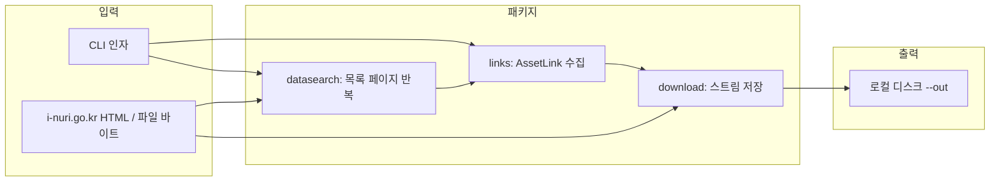

# crawler — 기술 스택·아키텍처

이 문서는 `crawler` 패키지가 사용하는 기술, 구성 요소, 데이터 흐름, 외부 사이트 연동 방식을 한 곳에 정리합니다.

---

## 1. 개요

| 항목 | 내용 |
|------|------|
| **목적** | i-누리(`i-nuri.go.kr`) 교사 포털에서 자료 목록 HTML을 읽고, 첨부 다운로드 URL(ZIP/PDF/MP4 등)을 수집한 뒤 로컬 디스크에 저장 |
| **실행 형태** | 단발 CLI (`python -m crawler`). 브라우저 자동화 없음 |
| **대상 도메인** | 기본 허용 호스트: `i-nuri.go.kr`, `www.i-nuri.go.kr` |

---

## 2. 기술 스택

### 2.1 언어·런타임

- **Python 3** — 패키지 코드 전역에서 `from __future__ import annotations` 사용(타입 힌트 호환).

### 2.2 외부 라이브러리 (`requirements.txt`)

| 패키지 | 역할 |
|--------|------|
| **httpx** (≥0.27) | HTTP 클라이언트. 세션 유지(`Client`), 스트리밍 다운로드(`stream`), 리다이렉트·쿠키·타임아웃 처리 |
| **beautifulsoup4** (≥4.12) | HTML 파싱. 파서는 내장 **`html.parser`** 사용 |

### 2.3 표준 라이브러리

| 모듈 | 용도 |
|------|------|
| **argparse** | CLI 인자(`--preset`, `--url`, `--out`, `--delay`, `--ext`, `--dry-run`, `--crawl`, 등) |
| **pathlib.Path** | 저장 경로·파일명 조합 |
| **urllib.parse** | `urlparse`, `urljoin`, `unquote`(Content-Disposition RFC5987) |
| **re** | 정규식(페이지 수, 다운로드 URL 패턴, 파일명 sanitize 등) |
| **time** | 요청 간 `sleep` (예의·부하 완화) |
| **dataclasses** | `AssetLink` 데이터 구조 |
| **typing** | `Iterator`, 타입 힌트 |

### 2.4 실행 진입점

- **`python -m crawler`** → `crawler/__main__.py` → `cli.main()`
- 또는 `from crawler.cli import main` 로 직접 호출 가능

---

## 3. 패키지 구조 (논리 아키텍처)

```
crawler/
├── requirements.txt
├── README.md
├── USAGE.md
├── ARCHITECTURE.md          ← 본 문서
└── crawler/
    ├── __init__.py          # 패키지 버전 문자열
    ├── __main__.py          # CLI 진입
    ├── cli.py               # 오케스트레이션: 인자 파싱, 큐/루프, 다운로드 호출
    ├── links.py             # HTML → 첨부 링크·게시글 제목 추출, 도메인 필터
    ├── download.py          # HTTP GET 스트리밍 저장, 파일명 결정, 인코딩 복구
    └── datasearch.py        # 자료누리 dataSearch 목록 페이지네이션(viewPage)
```

---

## 4. 컴포넌트 책임

### 4.1 `cli.py` — 오케스트레이터

- **HTTP 클라이언트 생성**: 브라우저 유사 `User-Agent`, `Accept-Language`, 선택적 `--cookie` 문자열 파싱 후 `httpx.Cookies`에 `i-nuri.go.kr` 도메인으로 설정.
- **두 가지 수집 모드** (상호 배타):
  1. **`--preset field-support`**  
     `datasearch.iter_field_support_list_pages()`로 현장지원자료 **전체 목록**의 모든 `viewPage` HTML을 순회.
  2. **`--url` 여러 개**  
     BFS로 HTML 페이지를 방문(`--max-pages` 상한). `--crawl` 시 `links.should_follow_teacher_url()`에 맞는 링크만 추가 큐잉.
- 각 HTML에 대해 `collect_links_from_html()` 호출 → `AssetLink` 집합을 URL 기준으로 합침.
- **`--dry-run`**: 수집 결과만 출력, 디스크 쓰기 없음.
- **다운로드 단계**: 정렬된 URL마다 `download_file()` 호출 후 `--delay` 초 대기.

### 4.2 `datasearch.py` — dataSearch 목록·페이지네이션

- **상수**: `FIELD_SUPPORT_ALL_LIST` — `manage_idx=31`, `menu_idx=60`(현장지원 **전체** 통합 목록).
- **첫 GET**: 위 URL로 초기 HTML 수신.
- **`parse_list_total_pages`**: `h2` 텍스트의 `현재/총 페이지` 정규식으로 총 페이지 수 추출.
- **`parse_data_search_form_pairs`**: `#dataSearchForm`을 `(name, value)` 튜플 리스트로 직렬화.  
  동일 `name` 체크박스(`sub_gubun_arr` 등)를 dict 대신 리스트로 유지해 **httpx GET params**와 호환.
- **`iter_field_support_list_pages`**:  
  - 1페이지는 첫 응답 HTML 재사용.  
  - 2페이지부터 `viewPage`만 바꾼 쿼리로 `DATA_SEARCH_INDEX` 재요청.  
  - 페이지 간 `delay_sec` 적용.

### 4.3 `links.py` — 링크 추출·크롤 범위

- **`AssetLink`**: `url`, `label`(첨부 표시명), `post_title`(같은 카드의 게시글 제목).
- **`collect_links_from_html`**:
  - 같은 호스트만 처리 (`DEFAULT_ALLOWED_HOSTS`).
  - **`/board/boardFile/download/.../*.do`**: 링크 텍스트·`title` 속성에서 확장자 추출 → `--ext`와 교집합일 때만 자산으로 추가.
  - **직접 `.zip`/`.pdf`/`.mp4` URL**도 확장자 필터 적용.
  - **`_post_title_for_download_anchor`**: 상위 `li` 등에서 `p.tit a` / `p.tit` 텍스트로 **게시글 제목** 연결.
  - **`follow_html_pages=True`** 일 때 `should_follow_teacher_url()`을 통과하는 `.do` 등만 다음 페이지 큐에 추가(메뉴 전역 링크 폭주 방지).

### 4.4 `download.py` — 저장·파일명·인코딩

- **스트리밍**: `httpx` `stream("GET")` + `iter_bytes`로 대용량 파일 대응.
- **파일명 우선순위** (개념):
  1. 응답 헤더 **`Content-Disposition`**  
     - RFC 5987 `filename*=UTF-8''...` → `urllib.parse.unquote`  
     - 레거시 `filename="..."`  
     - 헤더 바이트가 UTF-8/CP949 등으로 잘못 해석된 경우 → **`_recover_misdecoded_header_string`** (Latin-1로 되돌린 뒤 UTF-8 / CP949 / EUC-KR 순 시도, 한글 우선).
  2. 서버 이름이 **무의미한 첨부명**(예: `파일동영상.mp4`)이면 무시하고 게시글 제목 기반으로 재구성하는 분기 (`_is_generic_attachment_filename`).
  3. **`post_title` 있음**: 확장자는 `fallback_name`(첨부 표시)에서, 본문은 `게시글제목_파일번호.ext` 형태(`_board_file_id`로 URL에서 파일 ID 추출). 제목·첨부 문자열도 동일 복구 함수 통과.
  4. **`fallback_name`만**: sanitize + 필요 시 URL 파일 번호 접미사.
  5. **그 외**: URL 마지막 세그먼트 등.
- **`_sanitize_filename`**: Windows 금지 문자 `<>:"/\|?*` 제거.
- **중복 파일명**: 동일 경로 존재 시 `이름_2`, `이름_3` … 자동 부여.

---

## 5. 외부 사이트와의 계약(가정)

| 가정 | 설명 |
|------|------|
| 목록 UI | 자료누리 `dataSearch`는 폼 `#dataSearchForm` + 숨김 `viewPage`로 페이지 전환(JS와 동일 GET 재현). |
| 첨부 URL | `/board/boardFile/download/{게시판ID}/{게시글ID}/{파일ID}.do` 패턴. |
| 호스트 | 교차 도메인 링크는 `allowed_hosts` 밖이면 무시. |

사이트 구조·파라미터가 바뀌면 `datasearch.py` 상수·폼 파싱·`links.py` 선택자 조정이 필요할 수 있음.

---

## 6. 데이터 흐름 (요약)



- **Preset 경로**: `datasearch` → 각 페이지 HTML마다 `links` → URL 집합 확정 → `download`.
- **URL 크롤 경로**: 시드 URL GET → `links`가 첨부 + (옵션) 다음 HTML URL → 큐 소진 후 동일하게 `download`.

---

## 7. 비기능적 설계

| 주제 | 처리 |
|------|------|
| **부하** | `--delay`로 목록 요청·파일 요청 사이 sleep (기본 0.6초). |
| **인증** | `--cookie`로 세션 쿠키 주입(수동 복사 전제). |
| **확장자** | `--ext` 기본 `zip,pdf,mp4`. |
| **스케일** | `--max-pages`로 URL 모드 HTML 방문 상한. Preset은 목록 총 페이지에 따름. |

---

## 8. 관련 문서

- [USAGE.md](./USAGE.md) — 터미널 사용 예시
- [README.md](./README.md) — 진입 안내

---

## 9. 의도적으로 사용하지 않은 기술

| 미사용 | 이유 |
|--------|------|
| 브라우저 자동화(Selenium/Playwright) | 목록·첨부가 서버 렌더 HTML + 고정 다운로드 URL으로 충분 |
| 데이터베이스 | 상태 없음; 매 실행마다 전체 수집·중복은 파일 시스템·URL 집합으로 처리 |
| 비동기 asyncio | 단순 순차 다운로드·요청으로 구현 |

추후 “새 자료만 받기” 같은 증분 동기화는 **스케줄러 + 수신 URL 목록 영속화**를 추가하는 형태로 확장 가능(별도 설계).
